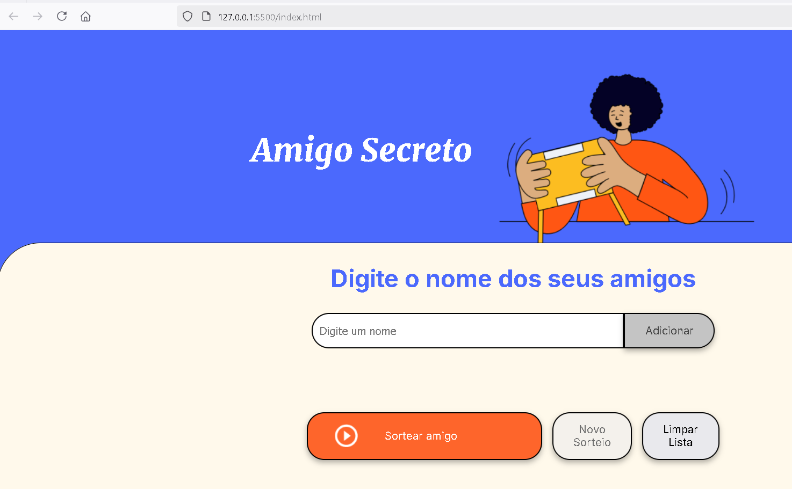

# 🎁 Amigo Secreto

Este é um projeto simples de sorteio de **Amigo Secreto** desenvolvido em **HTML, CSS e JavaScript**.
Os usuários podem adicionar nomes à lista, realizar sorteios e remover os sorteados até que todos sejam escolhidos.

## 📌 Funcionalidades
- Adicionar amigos à lista.
- Sortear aleatoriamente um nome da lista.
- Realizar um novo sorteio removendo o último sorteado.
- Limpar toda a lista de amigos.
- Interface responsiva e fácil de usar.

## 🛠️ Tecnologias Utilizadas
- **HTML5** → Estrutura do projeto.
- **CSS3** → Estilização da interface.
- **JavaScript (ES6+)** → Lógica do sorteio e manipulação do DOM.

## 🚀 Como Usar
1. Clone ou baixe o repositório.
2. Abra o arquivo `index.html` no navegador.
3. Digite os nomes dos participantes e clique em "Adicionar".
4. Clique em "Sortear Amigo" para iniciar o sorteio.
5. Use "Novo Sorteio" para remover o último sorteado e continuar.
6. Se desejar, clique em "Limpar Lista" para reiniciar tudo.

## 📂 Estrutura do Projeto
```
📁 amigo-secreto
│── 📄 index.html   # Página principal
│── 📄 style.css    # Estilos da aplicação
│── 📄 app.js       # Lógica do sorteio
│── 📁 assets       # Imagens e ícones
```

## 📷 Demonstração


## 💡 Melhorias Futuras
- Adicionar a opção de embaralhar automaticamente os nomes antes do sorteio.
- Implementar um backend para armazenar e recuperar listas de sorteios.
- Criar um modo "Amigo Secreto Anônimo", onde apenas o sorteado vê seu par.

## 📜 Licença
Este projeto é de código aberto e pode ser utilizado livremente.

---


